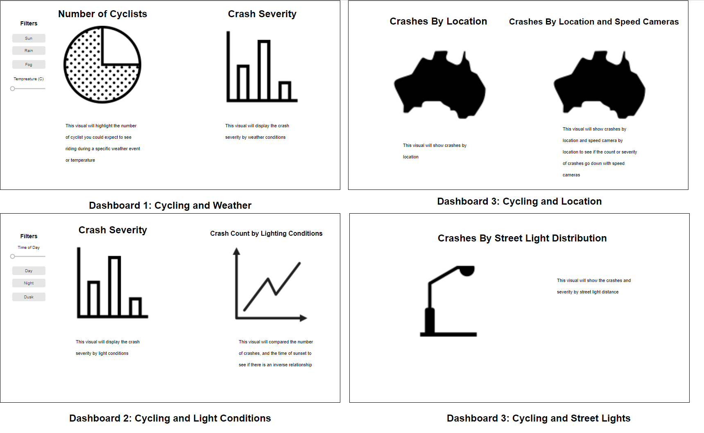

# COMP7230 Group Project
Winter Semester, 2021

## Project Proposal

## _Canberra: Changing Gears on Bike Safety_
_An investigation on the uphill battle facing cyclists_

### Group Members

1. Jonathon Longden (u7333077)

2. Tim Arney (u7378856)

3. Hugh Porter (u7398670)

### Overview

<!--

_A 2-3 paragraph overview of what the project is about and what will be delivered at the end of the semester._

This project will explore a number of aspects around cycling in the ACT:
1. The relationship between the number of cyclists and varying weather conditions;
2. The incidence of cycling crashes under varying weather conditions;
3. The incidence of cycling crashes under varying natural light conditions;
3. The prevalence of cycling crashes by geographical area.

-->

This project will explore a number of aspects related to cycling in the Australian Capital Territory (ACT), producing actionable suggestions on what can be done to reduce the rate of cycling accidents. This research will primaryly make use of the ACT 'Cyclist Crashes' data (See Data section below for link), along with other datasets, to identitfy any possible links between bicycles crashes: weather, time of day, and street lighting (also potentially speed camera if time permits).

The project will explore the following ideas:
1. Whether there is a relationship between the number of cyclist and varying weather conditions;
2. If the rate of cycling crashes varies depending on weather conditions;
3. How the seasonal changes in natural light (sunrise/sunset) affects the rate of cycling crashes;
4. The geographical location of cycling crashes;
5. The effects of street light on cycling crashes which occur during hours of low lighting (twilight/night);

The project may also potentially explore:
1. If speeding cameras reduce the number of cycling crashes.

### Dashboard Mockups

### Data

- [Cyclist Crashes](https://www.data.act.gov.au/Justice-Safety-and-Emergency/Cyclist-Crashes/n2kg-qkwj/data) - data.act.gov.au
    - 04/01/2012 - 03/10/2020
- [Bike Barometer](https://www.data.act.gov.au/Transport/ACT-Bike-Barometer-MacArthur-Avenue/62sb-92ea) - data.act.gov.au
    - 23/11/2017 - 18/05/2021
    - Hourly
- [Rainfall - Canberra Airport](http://www.bom.gov.au/jsp/ncc/cdio/weatherData/av?p_nccObsCode=136&p_display_type=dailyDataFile&p_startYear=&p_c=&p_stn_num=070351) - bom.gov.au
    - 2008 - current
    - Daily
- [Rainfall - Tuggeranong](http://www.bom.gov.au/jsp/ncc/cdio/weatherData/av?p_nccObsCode=136&p_display_type=dailyDataFile&p_startYear=&p_c=&p_stn_num=070339) - bom.gov.au
    - 1996 - current
    - Daily
- [Sunrise, Sunset & Twilight Times](https://geodesyapps.ga.gov.au/sunrise) - geodesyapps.ga.gov.au
    - No apparent download option / API
- [Suburb/Locality Boundaries](https://data.gov.au/dataset/ds-dga-0257a9da-b558-4d86-a987-535c775cf8d8/details) - data.gov.au
    - Current as of 01/09/2021
- [Street Lights](https://www.data.act.gov.au/Infrastructure-and-Utilities/ACT-Streetlights-Map-View/n9u5-bt96) - data.act.gov.au

_Optional Data_
- [Speed Cameras](https://www.data.act.gov.au/Justice-Safety-and-Emergency/Traffic-speed-camera-locations/426s-vdu4) - data.act.gov.au

### Questions:
We are playing on linking weather and street lighting in a similar way (using latitude and longitude). Is this an ideal method if we are looking to maximise our marks?

### Milestones

- 12/09/2021: Proposal submission
- 15/09/2021: Team meeting to discuss proposal feedback, and establish internal timeline
- 10/10/2021: Final submission

<!--
### References

_Any preliminary references that may be relevant for your project._
-->
