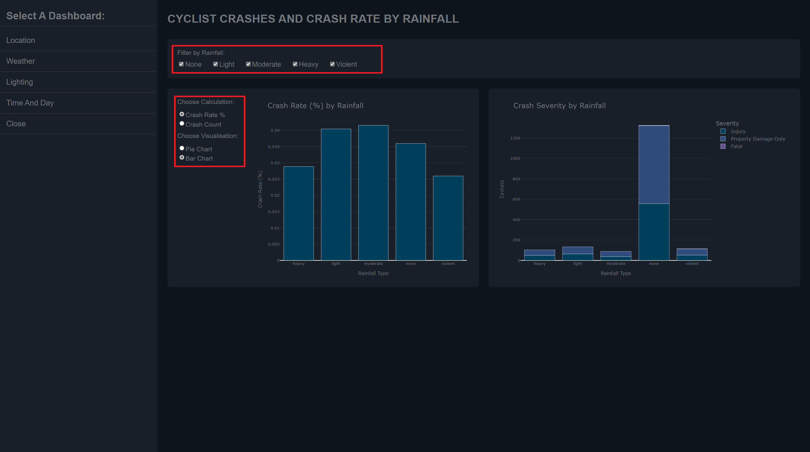

COMP7230 Group Project
Winter Semester, 2021

# _Canberra: Changing Gears on Bike Safety_
_An investigation on the uphill battle facing cyclists_

## System Requirements

__**ATTENTION:**__ This must be run using __**Python 3.9**__

The script may run on pre-Python 3.9 interpreters but there have been issue with data loading
into the visualisation on the dashboard. If you experience any issues there is the potential that
they may be remedied with a system upgrade. However, it may be quicker to run the application/visualisations
in __debug__ mode. This can be accomplished by:

1. Running ```$ python3 cycling_main.py -d``` in your preferred commandline
2. Changing line 16 in cycling_main.py from:
`DEBUG_MODE = False` to `DEBUG_MODE = True`


In addition to a `python3` interpreter, please ensure your system has the following third party modules installed:  


| Module | Version |
|--------|---------|
| dash | 2.0.0 |
| flask | 2.0.1 |
| numpy | 1.21.2 |
| pandas | 1.3.2 |
| plotly | 5.3.1 |
| requests | 2.26.0 |
| shapefile | 2.1.3 |
| shapely | 1.7.1 |
| suntime | N/A |

For more detailed compatibility information please see [REQUIREMENTS.md](REQUIREMENTS.md).

**Note:** It is also highly recommended that you run the dashboards on a screen with a resolution of 
1920px(w) X 1080px(H) you can achieve this resolution by zooming in or out in you internet browser of choice. 

## Execution

Please run `cycling_main.py` from within your preferred IDE, or from the command line:

```
$ python3 cycling_main.py
```

## Using The Dashboard App

### Navigation

On all pages of the application you will see a navigation menu of the left hand side of the screen (see screenshot below)


In the above screenshot all the items highlighted in red will direct you to a new dashboard, while the item highlighted in purple will stop the server ending the cycling_main run.

> Note: It is recommended that you click close when you are finished with the dashboard, otherwise the server will continue to run until you close the terminal.

### Dashboard One: Location

Visual one is an overiew of crashes by location, time, and severity.

#### Map Visual: Cyclists Crashes by District/Suburb

The map visual shows the number of crashes that have occured in a district or suburb for a given year. This visual can be manipulated to show a specific year, and can show either ACT's Districts, or ACT's Suburbs.

> By clicking on a district of suburb in the map you can also change the data shown in the visuals on the right hand side.

#### ACT's Crash Count by Year, Severity and Location

The visuals on the right hand side of the dashboard can be manipulatd by using the dropdown box or by clicking a district or suburb in the map visual (note if no location is selected the visuals will default to all).

#### Annotated Screenshot


### Dashboard Two: Weather

This dashboard shows the crash rate percentage, and crash count by rainfall type. Both visuals in this dashboard can be filtered using the checkbox as the top of the screen.

#### Crash Count/Crash Rate (%) Visual

The visual on the left hand side of the Dashboard can be altered to show either the crash count of crash rate perecentage, by using the choose calculation radio buttons. The visual can also be changed from a bar chart to a pie chart using the choose visualisations radio buttons.

> Please Note: on the crash rate (%) visual is avaliable as a bar chart the crash count visual will only be avaliable as a pie chart

#### Annotated Screenshot



### Dashboard Three: Lighting

This dashboard shows the number of crashes by month that occured within an hour (+/-) of sunset, and the number of crashes by street light count.

#### Crashes by Street Light Count

This visual can be manipulated to show severity via use of the radio buttons.

#### Annotated Screenshot


### Dashboard Four: Time And Day

This dashboard shows the number of crashes by day and time, all the viusals can be filtered on this page with the checkboxes at the top of the screen (highlighted in red in annotated screenshot section).

#### Map Visual: Crashes by Time of Day

This visual shows a crashes latitude and longitude for a give time period, you can filter the date in this map with the slider beneath it.

#### Crashes By Time

This visual shows the number of crashed by time. This visual can be group in 15 minute, 30 minute, 1 hour, 2 hour and 4 hour increments using the radio buttons on the left hand side.

#### Annotated Screenshot


